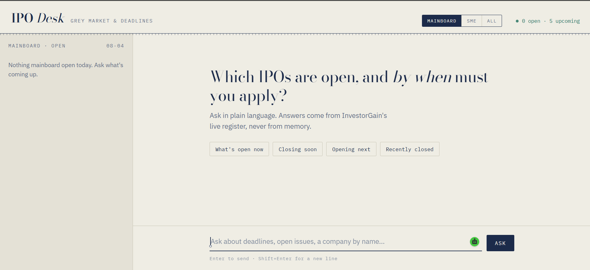
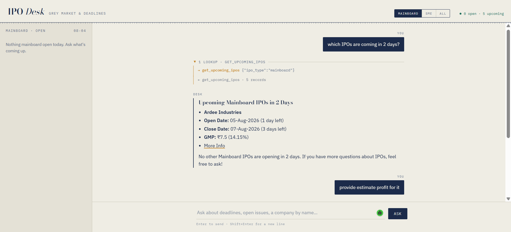

# IPO Desk

A lightweight IPO tracking assistant for the Indian stock market.

The project serves a simple web UI from `index.html` and provides two API endpoints:

- `GET /` - serves the HTML UI
- `GET /api/board` - returns open and upcoming IPO data
- `POST /api/chat` - streams chat responses from an LLM agent via Server-Sent Events

## Features

- Tracks Mainboard and SME IPOs
- Uses live registry and report endpoints from InvestorGain
- Provides open/upcoming IPO filters and calculated IPO listing estimates
- Streams chat responses for a conversational front-end experience

## Install

```bash
pip install -r requirements.txt
```

## Run

```bash
uvicorn server:app --reload --port 8000
```

Open `http://localhost:8000` in your browser.

## Configuration

Create a `.env` file in the project root for any environment variables your OpenAI/OpenAI-compatible client requires.

## Dependencies

- `fastapi`
- `uvicorn`
- `python-dotenv`
- `pydantic`
- `requests`
- `langchain-core`
- `langchain-openai`
- `langgraph`

## Screenshots



